# Havun Workflow — Complete Flowchart

> Volledige werkwijze van Havun/HavunCore in één overzicht.
> Voor eigen gebruik EN om aan klanten te tonen.
> Alle flowcharts zijn in Mermaid — render automatisch in GitHub, VS Code en de webapp.

---

## 0A. Complete Workflow voor Klantpresentaties

Dit ene diagram toont het hele traject: **intake → ontwikkeling → oplevering → nazorg**.
Perfect om aan klanten te laten zien.

```mermaid
flowchart TB
    subgraph Context[Context bij elke stap]
        Rules[[Werk Rules<br/>5 Onschendbare Regels<br/>CLAUDE.md per project<br/>Sessielimit 2-3 uur]]
        CoreLib[(HavunCore Bibliotheek<br/>patterns runbooks<br/>decisions reference<br/>projects templates)]
        Ollama[[Ollama lokaal<br/>nomic-embed-text<br/>768-dim vectors<br/>TF-IDF fallback]]
    end

    Client([Klant met idee]) --> Intake[INTAKEGESPREK<br/>wensen + eisen<br/>budget + planning<br/>KvK compliance check]
    Intake --> Analyse[Analyse fase<br/>scope bepalen<br/>bestaande patterns zoeken<br/>SaaS mindset check]
    Analyse -.zoekt in.-> CoreLib
    Analyse --> Offer[Offerte + plan<br/>schatting uren<br/>opleverfases]
    Offer --> ClientOk{Klant akkoord?}
    ClientOk -->|Nee| Intake
    ClientOk -->|Ja| Setup[Project setup<br/>GitHub repo<br/>CLAUDE.md template<br/>.claude/ structuur<br/>CI pipeline<br/>integrity.json]
    Setup -.gebruikt template.-> CoreLib

    Setup --> Start([/start sessie<br/>Git pull + Security audit])

    Start --> LeesDocs[Stap 1: LEES<br/>CLAUDE.md + context.md<br/>rules.md]
    LeesDocs -.leest.-> Rules
    LeesDocs --> KB1[(KB zoeken<br/>normen + standaarden)]
    KB1 -.zoekt via.-> Ollama
    KB1 -.haalt uit.-> CoreLib
    KB1 --> Classify{Groot of<br/>klein?}

    Classify -->|Smallwork<br/>typo/bug/refactor| Small[Log in smallwork.md<br/>direct fix]
    Classify -->|Groot<br/>feature/UI/business| DocsFirst[DOCS-FIRST]

    DocsFirst --> KB2[(KB zoeken<br/>bestaande docs)]
    KB2 -.zoekt via.-> Ollama
    KB2 -.haalt uit.-> CoreLib
    KB2 --> Report[Meld gebruiker:<br/>wat staat er + bronvermelding<br/>inconsistenties + gaten]
    Report --> Wait[Wacht op akkoord]
    Wait --> UpdateDocs[Update MD docs EERST<br/>plan vastleggen]
    UpdateDocs --> Denk

    Small --> Denk[Stap 2: DENK<br/>SaaS-mindset<br/>welke patterns<br/>gevolgen<br/>vragen stellen]
    Denk -.volgt.-> Rules

    Denk --> TestsBefore[Stap 3a: Tests VOOR<br/>php artisan test<br/>baseline meting]
    TestsBefore --> BaseOK{Baseline<br/>groen?}
    BaseOK -->|Nee| FixBase[Fix bestaande fouten]
    FixBase --> TestsBefore
    BaseOK -->|Ja| Code

    Code[Stap 3b: DOE<br/>Code schrijven atomair<br/>IDE syntax check<br/>geen haast]
    Code -.volgt.-> Rules
    Code --> KB3[(KB zoeken<br/>hoe anderen dit deden)]
    KB3 -.zoekt via.-> Ollama
    KB3 -.haalt uit.-> CoreLib

    KB3 --> Safety{Input type?}
    Safety -->|User input| FormReq[Form Request<br/>validation<br/>CSRF<br/>Policy authz]
    Safety -->|Externe API| ExtCall[Try-catch + timeout<br/>Custom exception<br/>Circuit breaker<br/>Retry + Fallback]
    Safety -->|Database| DBSafe[Eloquent ORM<br/>Transactions<br/>Guard clauses<br/>Parameter binding]
    Safety -->|Blade view| ViewSafe[Auto-escape<br/>CSRF token<br/>Security headers]
    Safety -->|Intern| Clean[Gewone code]

    FormReq --> WriteTests
    ExtCall --> WriteTests
    DBSafe --> WriteTests
    ViewSafe --> WriteTests
    Clean --> WriteTests

    WriteTests[Schrijf tests<br/>Unit + Feature<br/>Guard + Smoke<br/>Regression bij bug]
    WriteTests --> TestsAfter[Stap 4: TEST NA<br/>php artisan test<br/>coverage 80 procent]

    TestsAfter --> Coverage{Coverage<br/>haalt norm?}
    Coverage -->|Nee| WriteTests
    Coverage -->|Ja| Green{Alles groen?}

    Green -->|Nee| Code
    Green -->|Ja| Document[Stap 5: DOCUMENTEER<br/>project specifiek = .claude/<br/>herbruikbaar = HavunCore/kb/<br/>beslissing = decisions/]
    Document -.vult.-> CoreLib

    Document --> Integrity[.integrity.json check<br/>shadow file validatie]
    Integrity --> End([/end])

    End --> ReviewSW[Review smallwork.md<br/>naar permanente docs?]
    ReviewSW --> UpdateHand[Update handover.md<br/>context volgende sessie]
    UpdateHand --> LinterGate[Linter-Gate VERPLICHT<br/>tests + integrity<br/>regression bij bug]
    LinterGate --> LGOk{Alles groen?}
    LGOk -->|Nee| Code
    LGOk -->|Ja| Commit[Git commit atomair<br/>beschrijvend in Engels]

    Commit --> PostHook[Post-commit hook]
    PostHook --> KBUpdate[(KB auto-update<br/>delta indexing)]
    KBUpdate -.indexeert via.-> Ollama
    KBUpdate -.vult.-> CoreLib
    PostHook --> Push[git push naar GitHub]

    Push --> CI[GitHub Actions CI]
    CI --> CI1[composer install]
    CI1 --> CI2[SQLite test DB]
    CI2 --> CI3[php artisan migrate]
    CI3 --> CI4[php artisan test<br/>met coverage]
    CI4 --> CI5[composer audit<br/>security]
    CI5 --> CI6[Integrity check]
    CI6 --> CIOk{CI groen?}

    CIOk -->|Nee| FixCI[Fix lokaal + push opnieuw]
    FixCI --> Code
    CIOk -->|Ja| IsPublic{Publieke app?}

    IsPublic -->|Nee<br/>HavunCore| DirectProd[Direct productie<br/>git pull + cache clear]
    IsPublic -->|Ja<br/>HP/JT/HA/SP/HC| Staging[Deploy STAGING<br/>git pull + migrate<br/>cache clear + build]

    Staging --> TestStaging{Staging OK?}
    TestStaging -->|Nee| Code
    TestStaging -->|Ja| WaitPeriod{Grote<br/>wijziging?}
    WaitPeriod -->|Ja| Wait24[Wacht 24 uur<br/>users testen]
    WaitPeriod -->|Nee| Wait1[Wacht minimaal 1 uur]

    Wait24 --> ApprovalUser[Klant keurt goed]
    Wait1 --> ApprovalUser
    ApprovalUser --> Production[Deploy PRODUCTION<br/>git pull + migrate force<br/>cache clear]

    DirectProd --> Live
    Production --> Live([LIVE<br/>Oplevering aan klant])

    Live --> HandoverClient[Klant overdracht<br/>handleiding<br/>admin toegang<br/>contact noodlijn]
    HandoverClient --> Nazorg[NAZORG 24-7]

    subgraph NazorgBlok[Nazorg - continue kwaliteitsbewaking]
        Monitor[StatusView dashboard<br/>nginx php-fpm mysql<br/>PM2 + API + AI + KB]
        HealthCheck[Health endpoints<br/>elke minuut gecheckt]
        BackupsDaily[Backups automatisch<br/>hot 5min<br/>daily 03:00<br/>Hetzner offsite 7 jaar]
        SSLMon[SSL certificaten<br/>auto-renewal Certbot]
        SecAudit[Security audits<br/>composer audit dagelijks<br/>npm audit dagelijks]
        DepUpdate[Dependency updates<br/>Dependabot PRs]
        KBCron[KB auto-indexering<br/>08:03 + 20:07 lokaal<br/>6u cron server]
    end

    Nazorg --> Monitor
    Nazorg --> HealthCheck
    Nazorg --> BackupsDaily
    Nazorg --> SSLMon
    Nazorg --> SecAudit
    Nazorg --> DepUpdate
    Nazorg --> KBCron

    Monitor --> ErrorDetect{Production<br/>error 500?}
    ErrorDetect -->|Nee| Monitor
    ErrorDetect -->|Ja| AutoFix[AutoFix service]

    AutoFix --> AFChecks[shouldProcess checks:<br/>rate limit 1/uur/error<br/>excluded exceptions<br/>protected files<br/>24h rollback check<br/>project file only]
    AFChecks --> AFAI[Claude AI analyse<br/>via HavunCore AI Proxy]
    AFAI --> AFType{Response type?}

    AFType -->|NOTIFY_ONLY| AFNotify[Alleen melding<br/>geen code fix]
    AFType -->|FIX| AFApply[Backup origineel<br/>Apply FILE/OLD/NEW]
    AFApply --> AFSyntax[php -l syntax check]
    AFSyntax --> AFSynOk{Syntax OK?}
    AFSynOk -->|Nee| AFRollback[Auto-rollback<br/>restore backup]
    AFSynOk -->|Ja| AFBranch[Hotfix branch<br/>hotfix/autofix-xxx]
    AFBranch --> AFCommit[git commit + push]
    AFCommit --> AFPR[GitHub PR via REST API]
    AFPR --> ClaudePR[Claude PR review<br/>CI failure monitoring]
    ClaudePR --> AdminUI[Admin UI /admin/autofix<br/>geen email spam]

    AFNotify --> AdminUI
    AFRollback --> AdminUI
    AdminUI --> Monitor

    Nazorg --> ClientReq{Klant vraagt<br/>wijziging of<br/>nieuwe feature?}
    ClientReq -->|Ja| Intake
    ClientReq -->|Nee| Monitor

    subgraph Remote[Claude Remote Control /rc]
        RC[Claude Code Mobile App<br/>QR code scan<br/>stuur commando's vanuit telefoon]
    end

    Dev([Ontwikkelaar<br/>Henk van Unen]) --> Start
    Dev -.gebruikt onderweg.-> RC
    RC -.stuurt naar PC sessie.-> Start

    style Client fill:#fef9c3
    style Intake fill:#fef9c3
    style Offer fill:#fef9c3
    style ClientOk fill:#fef9c3
    style Setup fill:#fef9c3
    style Start fill:#dbeafe
    style Classify fill:#fef3c7
    style Safety fill:#fef3c7
    style Live fill:#d1fae5
    style HandoverClient fill:#d1fae5
    style Nazorg fill:#fed7aa
    style NazorgBlok fill:#fff7ed
    style Rules fill:#fee2e2,stroke:#dc2626,stroke-width:3px
    style CoreLib fill:#fae8ff,stroke:#a855f7,stroke-width:3px
    style Ollama fill:#fff7ed,stroke:#fb923c,stroke-width:3px
    style KB1 fill:#f3e8ff
    style KB2 fill:#f3e8ff
    style KB3 fill:#f3e8ff
    style KBUpdate fill:#f3e8ff
    style AutoFix fill:#fed7aa
    style CI fill:#e0e7ff
    style Monitor fill:#fed7aa
    style Staging fill:#fef9c3
    style Production fill:#d1fae5
    style AFRollback fill:#fee2e2 
    style Dev fill:#dbeafe
    style ClientReq fill:#fef9c3
```

**Wat toont deze flowchart aan klanten?**

1. **Gele blokken (intake)** — Hoe we het project starten: gesprek, analyse, offerte, akkoord, setup
2. **Blauw/paars/oranje (ontwikkeling)** — De complete build flow met alle kwaliteitscontroles
3. **Groen (oplevering)** — LIVE + klantoverdracht met handleiding en noodlijn
4. **Oranje blok (nazorg)** — 7 ondersteunende systemen die 24/7 actief blijven
5. **Feedback loop** — Elke nieuwe klantwens gaat terug naar intake

De klant ziet direct dat onderhoud niet "vanzelf goed blijft gaan" — het vereist actieve monitoring, backups, security audits en AutoFix.

---

## 0B. Het Hele Ecosysteem

```mermaid
flowchart TB
    subgraph Dev[Ontwikkelaar Henk van Unen]
        D1[VS Code + Claude Code]
        D2[/start - /end - /kb - /md - /update]
    end

    subgraph Projects[9 Havun Projecten]
        P1[HavunCore - centrale hub]
        P2[JudoToernooi]
        P3[Herdenkingsportaal]
        P4[HavunAdmin]
        P5[Studieplanner]
        P6[SafeHavun]
        P7[Infosyst]
        P8[HavunClub]
        P9[havun.nl]
    end

    subgraph KB[Kennisbank - doc_intelligence]
        K1[MD docs 1944+ bestanden]
        K2[Ollama nomic-embed-text]
        K3[SQLite vector database]
        K4[Post-commit hooks]
    end

    subgraph Quality[Kwaliteitsborging]
        Q1[Coverage 80% enterprise]
        Q2[Form Requests]
        Q3[Rate limiting]
        Q4[Circuit breakers]
        Q5[Custom exceptions]
        Q6[Audit trail]
    end

    subgraph CI[GitHub Actions CI/CD]
        CI1[Composer install]
        CI2[PHPUnit tests]
        CI3[Coverage check]
        CI4[composer audit]
        CI5[Integrity check]
    end

    subgraph Server[Hetzner Productie Server]
        S1[Nginx + PHP-FPM 8.2]
        S2[MySQL + SQLite]
        S3[PM2 Node.js apps]
        S4[Hot backup 5min]
        S5[Daily backup 03:00]
        S6[Hetzner Storage Box]
    end

    subgraph Monitor[Monitoring 24-7]
        M1[StatusView dashboard]
        M2[AutoFix AI herstel]
        M3[Health checks]
        M4[GitHub PR auto-review]
    end

    Dev --> Projects
    Projects --> KB
    KB --> Dev
    Projects --> Quality
    Quality --> CI
    CI --> Server
    Server --> Monitor
    Monitor --> AutoFix2[AutoFix genereert PR]
    AutoFix2 --> Projects

    style Dev fill:#dbeafe
    style KB fill:#fce7f3
    style Quality fill:#fef3c7
    style CI fill:#e0e7ff
    style Server fill:#d1fae5
    style Monitor fill:#fed7aa
```

---

## 1. Sessie Starten — /start Commando

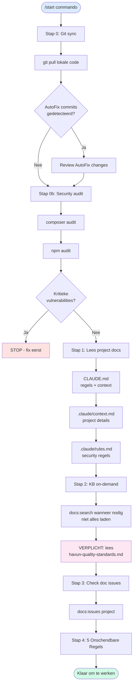

**De 5 Onschendbare Regels:**

1. NOOIT code zonder KB + kwaliteitsnormen te raadplegen
2. NOOIT features/UI-elementen verwijderen zonder instructie
3. NOOIT credentials/keys/env aanraken
4. ALTIJD tests draaien voor én na wijzigingen (coverage >80%)
5. ALTIJD toestemming vragen bij grote wijzigingen

---

## 2. MD Docs — De Bron van Waarheid

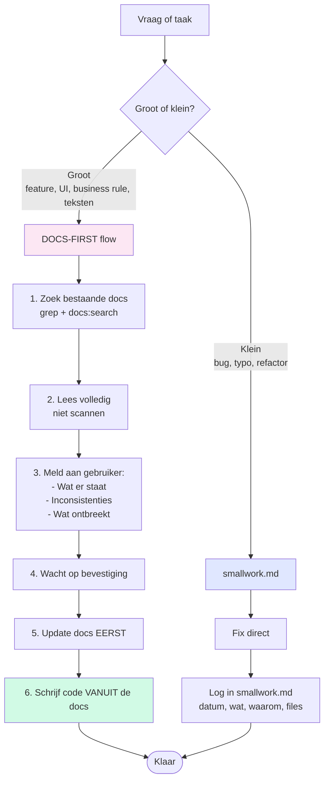

**Hierarchie — waar staat welke info:**

```mermaid
flowchart LR
    subgraph Project[Per project zelfstandig]
        PC[CLAUDE.md<br/>max 60 regels]
        PX[.claude/context.md<br/>project details]
        PS[.claude/smallwork.md<br/>kleine fixes log]
        PH[.claude/handover.md<br/>vorige sessie]
        PR[.claude/rules.md<br/>security regels]
    end

    subgraph Core[HavunCore centrale KB]
        CC[CLAUDE.md]
        CX[.claude/context.md<br/>credentials, server]
        KBP[docs/kb/patterns/<br/>herbruikbare code]
        KBR[docs/kb/runbooks/<br/>procedures]
        KBRef[docs/kb/reference/<br/>API specs, server]
        KBD[docs/kb/decisions/<br/>ADR architectuur]
        KBT[docs/kb/templates/<br/>setup templates]
        KBCon[docs/kb/contracts/<br/>gedeelde definities]
        KBProj[docs/kb/projects/<br/>per-project details]
    end

    Project -->|weet iets niet| Core
    Core -->|verstrekt info| Project

    style Project fill:#dbeafe
    style Core fill:#fce7f3
```

---

## 3. KB — De Kennisbank (Doc Intelligence)

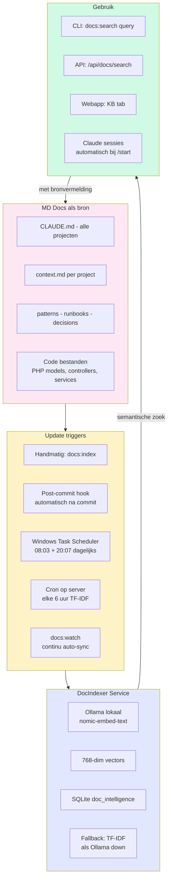

**KB zoeken met type filter:**

```bash
docs:search "mollie betaling"                  # Alle types
docs:search "login auth" --type=controller     # Alleen controllers
docs:search "memorial lifecycle" --type=docs   # Alleen MD docs
docs:search "poule indeling" --type=model      # Alleen Eloquent models
docs:search "havun quality" --type=docs        # Enterprise normen
```

**File types in de KB:**

| Type | Beschrijving |
|------|--------------|
| `docs` | MD documenten |
| `model` | Eloquent models |
| `controller` | HTTP controllers |
| `service` | Service classes |
| `middleware` | HTTP middleware |
| `command` | Artisan commands |
| `migration` | Database migrations |
| `route` | Route definities |
| `config` | Config bestanden |
| `view` | Blade templates |
| `test` | Test bestanden |
| `support` | Enums, DTOs, Events, Jobs, Traits, Exceptions |
| `structure` | Auto-generated structuur overzicht |

**Statistieken (april 2026):** 1944+ geïndexeerde bestanden over 13 projecten.

---

## 4. Code Schrijven — Docs First, Test First, Veiligheid First

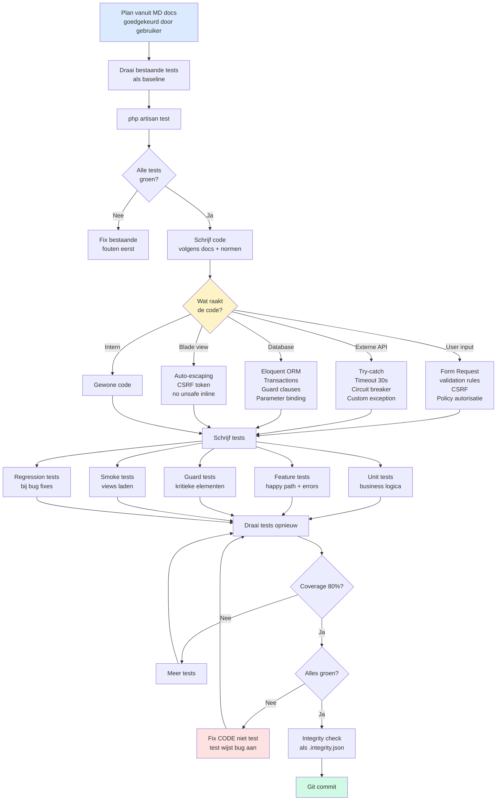

**Test coverage standaarden:**

| Niveau | Coverage |
|--------|----------|
| Gevaarlijk | 0-20% |
| Basis | 20-40% |
| Goed | 40-60% |
| Professioneel | 60-80% |
| **Enterprise (NORM)** | **80-90%** |
| Mission-critical | 90%+ |

**Actuele stand per project** → [`test-coverage-normen.md`](../runbooks/test-coverage-normen.md)

---

## 5. Veiligheid — 10 Opvangmethoden

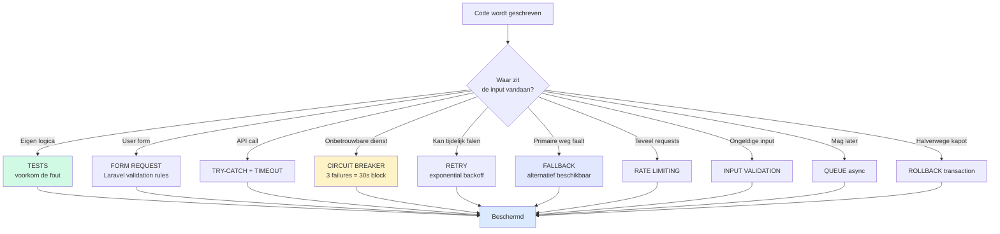

**Praktische voorbeelden bij Havun:**

| Methode | Gebruikt bij |
|---------|--------------|
| **Tests** | 87,4% coverage HavunCore, 8 van 9 projecten boven 80% |
| **Form Requests** | Alle user input in JudoToernooi, HP, HavunAdmin |
| **Try-catch + Timeout** | Mollie API, Ollama embeddings, HTTP::timeout(30) |
| **Circuit breaker** | Mollie service, Reverb WebSockets |
| **Retry** | AutoFix max 2 pogingen, API calls bij 503 |
| **Fallback** | Ollama down → TF-IDF in DocIndexer |
| **Rate limiting** | API 60/min, login 5/min, forms 10/min, webhooks 100/min |
| **Input validation** | Laravel Form Requests + Nederlandse messages |
| **Queue** | Arweave blockchain uploads, email versturen |
| **Rollback** | AutoFix bij syntax fout, database transacties |

**Custom Exception hiërarchie (JudoToernooi voorbeeld):**

```mermaid
flowchart TB
    E[\Exception] --> JT[JudoToernooiException<br/>base + userMessage + context]
    JT --> M[MollieException<br/>error codes 1001-1005]
    JT --> I[ImportException<br/>row-level tracking]
    JT --> Ex[ExternalServiceException<br/>timeout, connection, process]

    M --> M1[apiError]
    M --> M2[timeout]
    M --> M3[tokenExpired]
    M --> M4[paymentCreationFailed]

    I --> I1[fileReadError]
    I --> I2[invalidFormat]
    I --> I3[missingColumns]
    I --> I4[rowError]
    I --> I5[partialImport]

    Ex --> Ex1[timeout]
    Ex --> Ex2[connectionFailed]
    Ex --> Ex3[processError]

    style JT fill:#fce7f3
    style M fill:#dbeafe
    style I fill:#e0e7ff
    style Ex fill:#fef3c7
```

---

## 6. Testen — 5 Soorten Tests

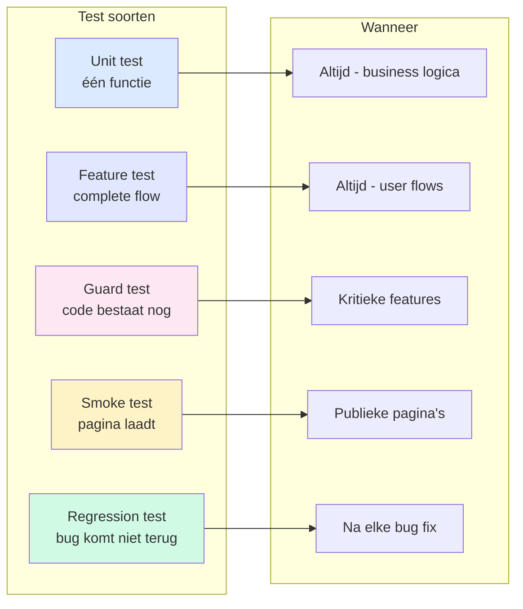

**Bug fix workflow:**

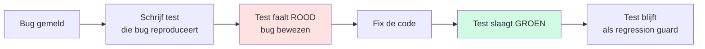

---

## 7. GitHub Actions CI

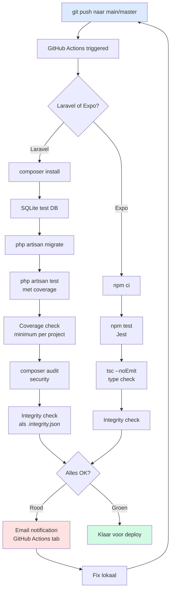

**CI status per project (april 2026):**

| Project | CI | Coverage check | Security audit | Integrity |
|---------|-----|---------------|----------------|-----------|
| HavunCore | ✅ | ✅ | ✅ | - |
| HavunAdmin | ✅ | ✅ | ✅ | - |
| Herdenkingsportaal | ✅ | ✅ | ✅ | ✅ |
| JudoToernooi | ✅ | ✅ | ✅ | - |
| Studieplanner | ✅ | ✅ | - | ✅ |
| SafeHavun | ✅ | ✅ | ✅ | - |
| Infosyst | ✅ | ✅ | ✅ | - |
| HavunClub | ✅ | ✅ | ✅ | - |

---

## 8. Deploy — Lokaal → Staging → Production

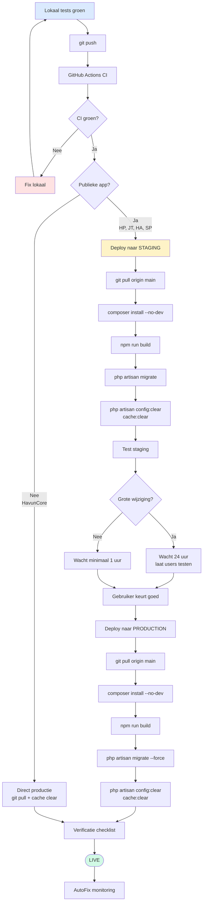

**Post-deploy checklist:**

- [ ] Config cache geleegd
- [ ] Applicatie laadt zonder errors
- [ ] Kritieke features getest
- [ ] Logs gecontroleerd
- [ ] Health endpoint `/health` groen
- [ ] StatusView dashboard groen

---

## 9. AutoFix — Automatisch Productie Herstel

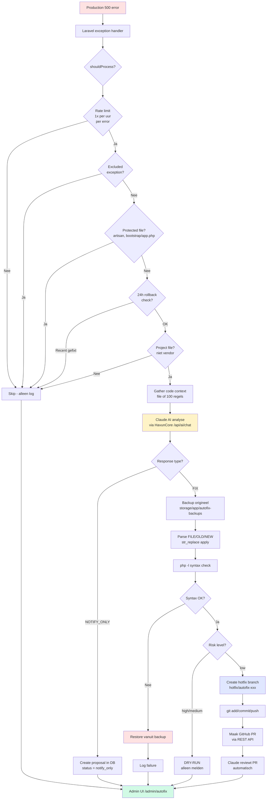

**AutoFix fix-strategie (priority):**

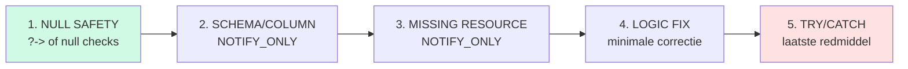

**AutoFix regels:**

- Max 2 pogingen per error
- Rate limit: 1 fix per uur per uniek error
- Protected files: artisan, index.php, bootstrap/app.php, composer.*
- Branch-model: NIET direct naar main, altijd via PR
- Email uitgeschakeld (via `AUTOFIX_EMAIL=`)
- Notificaties via admin UI: `/admin/autofix`

**Actief op:** JudoToernooi, Herdenkingsportaal

---

## 10. 5 Beschermingslagen tegen Regressie

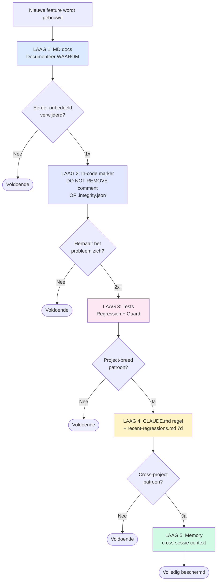

**Laag 2 — .integrity.json shadow file:**

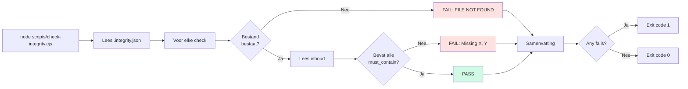

---

## 11. HavunCore Webapp — StatusView Dashboard

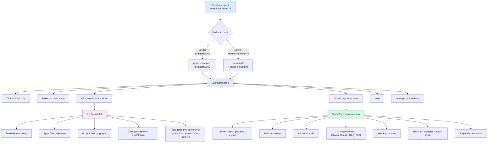

**URLs:**

- Lokaal: `http://localhost:8000` (Vite dev) + `http://localhost:8009` (Node backend)
- Server: `https://havuncore.havun.nl`

---

## 12. Claude Code Remote — /rc

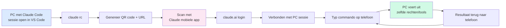

**Voorwaarden:**

- Claude Code v2.1.80+
- claude.ai login (niet API key)
- PC moet aan staan en Claude Code open

**Gebruik:**

- Onderweg commando's sturen
- Zelfde bestanden/rechten als PC sessie
- Ideaal voor snelle checks/fixes

---

## 13. Kwaliteitsnormen — Havun Enterprise Standaard

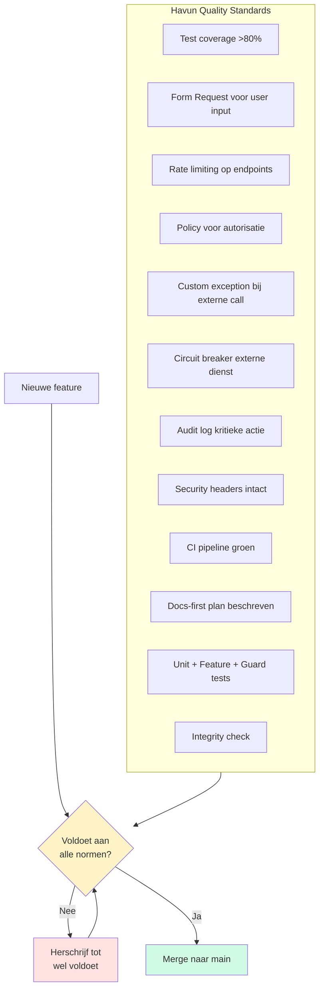

**Volledige normen:** `docs/kb/reference/havun-quality-standards.md`

---

## 14. Backup Systeem

```mermaid
flowchart LR
    subgraph Sources[Productie databases]
        DB1[havunadmin_production]
        DB2[herdenkingsportaal_production]
        DB3[judo_toernooi]
        DB4[infosyst, safehavun, etc]
    end

    subgraph Local[Server local /var/backups]
        L1[Hot backup 5 min<br/>2 uur retentie]
        L2[Daily backup 03:00<br/>7 dagen retentie]
    end

    subgraph Remote[Hetzner Storage Box]
        R1[Permanent archief<br/>SFTP upload]
        R2[Per jaar/maand/dag]
    end

    Sources --> L1
    Sources --> L2
    L2 --> R1
    R1 --> R2

    Restore[Restore optie] --> L2
    Restore --> R1

    style Sources fill:#dbeafe
    style Local fill:#fef3c7
    style Remote fill:#d1fae5
```

**Backup schedule:**

- **Hot backup** (elke 5 min): HavunAdmin, Herdenkingsportaal, JudoToernooi — laatste 2 uur
- **Daily backup** (03:00): alle databases + storage folders — 7 dagen lokaal
- **Offsite upload** (na daily): Hetzner Storage Box — permanent

---

## 15. Samenvatting voor Klanten

### Wat Havun uniek maakt

> "Docs-first, test-driven, defensief coderen, automatisch gemonitord, automatisch hersteld."

| Aspect | Wat Havun biedt | Industriestandaard |
|--------|----------------|-------------------|
| **Test coverage** | 80-98% (enterprise) | 0-40% |
| **Documentatie** | 1944+ MD bestanden, semantisch doorzoekbaar | Achteraf, verouderd |
| **Veiligheid** | OWASP compliance, CSP, HSTS, Form Requests | Laravel defaults |
| **Input validatie** | Elke user input via Form Requests | Ad-hoc |
| **Rate limiting** | Per endpoint type (API, login, webhook) | Vaak niet |
| **Error handling** | Custom exceptions + circuit breakers + fallbacks | Try-catch overal |
| **Auditing** | Wie, wat, wanneer — volledig traceerbaar | Log files |
| **Foutherstel** | AutoFix 24/7 met Claude AI | Handmatig na melding |
| **Backups** | 5-min hot + dagelijks + offsite | Dagelijks |
| **Monitoring** | StatusView dashboard + health checks | Uptime monitoring |
| **CI/CD** | Elke push tests + security audit | Soms |
| **Multi-sessie veiligheid** | 5 beschermingslagen tegen regressie | Niet bestaand |

### Onze werkwijze in één flowchart

```mermaid
flowchart LR
    A[1. Docs First<br/>MD plan eerst] --> B[2. KB zoeken<br/>bestaande kennis]
    B --> C[3. Tests schrijven<br/>coverage >80%]
    C --> D[4. Code veilig<br/>form requests,<br/>exceptions,<br/>circuit breakers]
    D --> E[5. CI pipeline<br/>automatische checks]
    E --> F[6. Staging<br/>publieke apps]
    F --> G[7. Productie]
    G --> H[8. AutoFix 24/7<br/>+ health checks]
    H --> I[9. Backups<br/>5min + dagelijks]
    I --> J[10. KB auto-update<br/>cross-sessie context]
    J --> A

    style A fill:#dbeafe
    style G fill:#d1fae5
    style H fill:#fef3c7
```

---

## Hoe te gebruiken

### In VS Code
Dit MD bestand opent automatisch de flowcharts als je de **Mermaid preview** extensie hebt geïnstalleerd.

### Op GitHub
Flowcharts renderen automatisch bij het bekijken van dit bestand in de GitHub web interface.

### In de webapp
Kan worden opgenomen in de HelpView voor directe toegang voor alle gebruikers.

### Printen voor klant
Export naar PDF via VS Code of GitHub → Download als PDF.

### Voor Claude sessies
Dit document is automatisch geïndexeerd in de KB — Claude vindt het met:
```bash
cd D:\GitHub\HavunCore && php artisan docs:search "havun workflow flowchart"
```

---

## Verwijzingen

| Onderwerp | Document |
|-----------|----------|
| Kwaliteitsnormen | `docs/kb/reference/havun-quality-standards.md` |
| Kwaliteitsniveaus | `docs/kb/reference/software-quality-levels.md` |
| Development workflow | `docs/kb/reference/development-workflow.md` |
| Werkwijze | `docs/kb/runbooks/claude-werkwijze.md` |
| AutoFix | `docs/kb/reference/autofix.md` |
| Testing patterns | `docs/kb/patterns/regression-guard-tests.md` |
| Error handling | `docs/kb/patterns/error-handling-strategies.md` |
| Integrity check | `docs/kb/patterns/integrity-check.md` |
| Doc Intelligence | `docs/kb/runbooks/doc-intelligence-setup.md` |
| GitHub Actions | `docs/kb/runbooks/github-actions-ci.md` |
| Deploy | `docs/kb/runbooks/deploy.md` |
| Backup | `docs/kb/runbooks/backup.md` |
| Server | `docs/kb/reference/server.md` |
| JT Stability (728 regels) | `D:\GitHub\JudoToernooi\laravel\docs\3-DEVELOPMENT\STABILITY.md` |

---

*Laatst bijgewerkt: 10 april 2026*
*Havun — Docs-first, test-driven, defensief, automatisch.*
